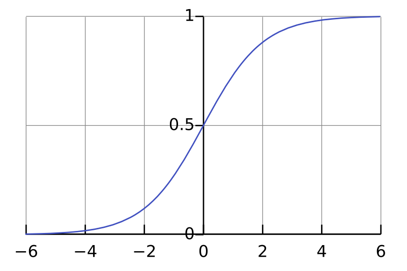
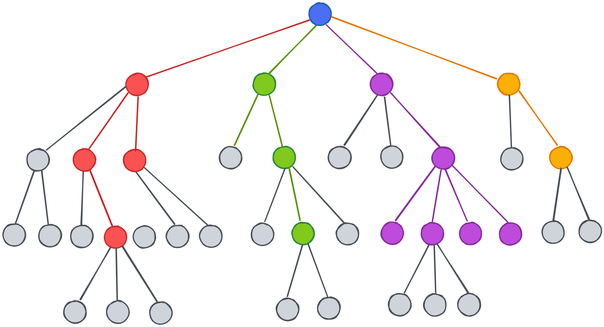
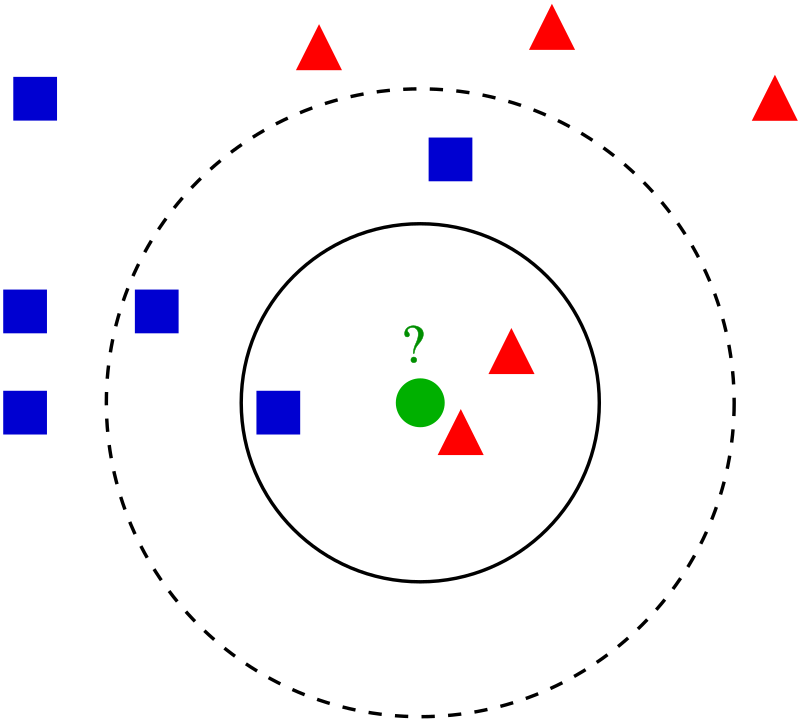

# 2. Methods

## 2.1 Data Architecture and Scaling Strategy

The MARS model infused ML pipeline established in the prior section of this capstone will assessed using 3 datasets as part of a broader horizontal scaling strategy to substantiate its real word applications. Therefore the datasets used herein will be the IBM dataset[@pavansubhasht_2017] which will be employed as a baseline for methodological and code calibration, the Edward Edward Babushkin Employee Turnover dataset [@babushkin_2017] to grapple with feature sparsity and finally, the Data Scientist Job Change dataset[@arashnic_2020] intended as a computational test set due to its comparatively larger size.

Below is a more comprehensive overview of the provenance and features of each dataset:

**1. IBM dataset (1470 rows, 35 columns):**
Introduced earlier as the baseline dataset for this study in debugging the pipeline and conducting feature extraction. The IBM HR Attrition Dataset was compiled by Data Scientists at IBM in an effort to synthesize realistic attrition scenario for predictive modelling studies [@pavansubhasht_2017]. This dataset has been pruned to 15 features corresponding to the four prongs of the MARS model with non-informative and zero variance columns being prioritized for removal. Below is a summary of feature mappings to their ascribed MARS factors:

* **Motivation (M):** To operationalize the Motivation factor within the IBM dataset, the pipeline extracts the `JobSatisfaction`, `TrainingTimesLastYear` and `StockOptionLevel` Features. `JobSatisfaction` serves as a direct psychological proxy for an employee's internal drive and engagement levels which merits its assignment to the Motivation label.The inclusion of `TrainingTimesLastYear` *(Amount of time spent training in the previous year)* and `StockOptionLevel` *(flag for senior level organizational rewards)* in this category further nuance the exploration of this category by serving as stand-in’s for intrinsic and extrinsic motivational factors respectively.

* **Ability (A):** Ability is mathematically encoded through the `PerformanceRating`, `Education`, `EducationField` and `YearsAtCompany` variables. Given that Ability is understood in OB (Organizational Behavior) Research to be a combination of natural aptitude and learned skills. `PerformanceRating` and `YearsAtCompany` will serve here as estimations of learned skill while `Education` and `EducationField` will serve as generalizations of aptitude.

* **Role Perception (R):** To capture this factor the model relies on the `Department`, `JobLevel`, `YearsInCurrentRole` and `YearsWithCurrManager` features. Here `Department` and `JobLevel` dictate the structural clarity of the employee's responsibilities and hierarchical expectations within the enterprise while `YearsInCurrentRole` and `YearsWithCurrManager` account for variance in this factor on account of tenure and longevity.

* **Situational Factors (S):** given their capacity to measure external logistical stressors that impact turnover independent of an employee's actual ability or motivation, the `DistanceFromHome`, `BusinessTravel` and `EnvironmentSatisfaction` columns will be retained in our feature selection phase to model situational constraints

**2. Edward Babushkin Employee Turnover dataset (1129 rows, 16 columns):**
As real world enterprise data operations present challenges to data mining on employees in the form of sparse and un-curated datasets as they’re often compiled together with input from multiple departments (HR, Marketing, Payroll, Legal etc.), the Babushkin dataset which is derived from Edward Babushkin, an enterprise HR researcher [@babushkin_2017], will serve as a test case in encountering and regulating these data idiosyncrasies.
 
As Babushkin has sourced this dataset from a native Russian HRIS system, the variables suffer from a heavy "lost-in-translation" effect when ingested by a culturally dissimilar audience.
 
For example, the target attrition flag column of this dataset is called `event` and is binary encoded.
 
Other Emic features of this dataset include `stag` which stands for *Stazh* (стаж), which is Russian for "Length of Service", it represents tenure in months and will map to the **Ability** factor of the MARS paradigm.
 
**Situational** factors in this dataset will be represented by the `greywage`, `way` and `traffic` columns. `way` refers to the commute method of the employee (labels include `bus`, `car` and `foot`), `traffic` is the source of hire ranging from local job aggregators (like the label `youjs`) or referrals (labels `referal` and `recNErab` to represent internal and external referrals respectively) and finally the `greywage` describes the compensation method as it pertains to Russian corporate culture. For this feature, a "white wage" refers to an employee who’s salary is 100% official and reported to the tax authorities, In contrast, a "grey wage" means the company pays the minimum wage officially but otherwise remunerates the employee in a circumspect and extra-legal manner.
 
**Role Perception** within this sparse architecture is operationalized through the `industry` and `profession` variables, which establish the structural boundaries of the employee's duties. Furthermore, this category uniquely incorporates the `coach` binary feature, serving as a critical proxy for how effectively the enterprise clarified those job expectations via formal mentorship.
 
Lastly, Babushkin’s dataset presents this study with all five factors of the Five factor model (also known as “FFM Model”, the most widely accepted and empirically validated framework in personality psychology for describing human personality). Elements of the five factor model and their nomenclature in the Russian HRIS ecosystem as employed by Babushkin are as follows: Extraversion (`extraversion`), Neuroticism (`anxiety`), Conscientiousness (`selfcontrol`), Openness to Experience (`novator`) and Agreeableness (represented on a reverse scale by the `independ` feature as high independence implies low agreeableness). These five columns in tandem will be mapped to the **Motivation** prong of the MARS model and offer us a direct approach in measuring motivation when contrasted against the proxy variables or features that will be employed in other datasets.

**3. Data Scientist Job Change dataset (19158 rows, 14 columns):**
Aggregated by an HR management firm to identify flight risks and poaching vulnerabilities specifically within the hyper-competitive Data Science and tech sector [@arashnic_2020], this dataset will be employed to demonstrate the scalability of the MARS-Machine Learning Pipeline to larger datasets which are also often challenged by imperfections like missing data.
 
The selection of this dataset also exposes the attrition modeling pipeline being constructed in this report to the particularities of bourgeoning and novel field of practice (Data Science) and thereby will allow for an examination of its generalizability to future data via its exposure to recent, sector-specific attrition patterns. This approach ensures the pipeline remains relevant as modern work behaviors evolve.
 
Contained in this dataset is the attrition column of interest titled `target` and is a binary flag of turnover status. The **Motivation** factor of the MARS model will operationalized by the `enrolled_university` and `last_new_job` features as the university enrollment status of an employee is a direct proxy for their intrinsic motivation to upskill in the form of continuing education. The `last_new_job` feature can be viewed in this context as a quantifiable proxy for career velocity and job-hopping propensity, measuring the temporal gap between an employee's organizational transitions.
 
The **Ability** prong of MARS will be captured mathematically by the `relevent_experience` and total `experience` (years) columns as in the hyper-specialized tech sector, the competency of data science leadership is optimally elucidated by longitudinal experience, reflecting an accrued mastery of the Enterprise Tech Stack integral to their role.
 
**Role Perception** will be represented by the `company_size`, `company_type`, and `training_hours` features. The selection of this subset is contingent on the logic that size and type of the startup/enterprise dictate the structural boundaries of the data scientist's role, while `training_hours` quantifies how much formal onboarding they received to clarify those expectations.
 
Finally **Situational** factors will be accounted for via the `city_development_index` variable which is fashioned by its authors as a macro-environmental feature that measures the quality of life and economic scaling of the city the employee lives in, serving as an external logistical stressor independent of the employee's actual job performance.

**Data Pre-processing Summary:** The heterogeneous origins of the datasets employed by this study necessitate standardization through a strict, uniform preprocessing pipeline before being fed into Python’s scikit-learn algorithms which will underpin the computational engine of this MARS-Machine Learning pipeline. Given the unintelligibility of plain text strings like `industry` or `commute method` to machine learning models, One-Hot Encoding will be performed to reorient these features to binary sparse matrices (0s and 1s). The ubiquity of magnitude disparities encountered in numerical columns will further compel the use of a scaling strategy like MinMax Scaling which normalize numerical features so that algorithms reliant on spatial geometry and Euclidean distance (like Linear SVM and kNN) are not mathematically distorted by arbitrarily large values. To meet the challenge of missing categorical data (as encountered in the Data Science Job Change dataset), Constant Imputation will be utilized as this study’s imputation strategy of choice given that record elimination would result in an infeasible training or sample set size and that modal imputation (imputing each column with the most frequently occurring label) would mathematically distort the reality of the data. The Constant Imputation method stipulates that missing values are uniformly filled with a new standalone string class called `Unknown`. Doing so will allow algorithms availed in this study to evaluate if the sheer lack of enterprise data in itself is actually a predictive behavioral signal for attrition.

## 2.2 Mathematical Frameworks

The properly establish statistical validity and pattern generalizability across the disparate datasets used in this study and in keeping with Tambe's framework for modern HR analytics, the predictive architecture constructed there in will be underpinned by a comparative panel of six distinct classification algorithms: Standard Logistic Regression, Regularized Logistic Regression ( featuring an L2 or Ridge Penalty), Linear Kernel SVM, Decision Tree Classifier,  the k-Nearest Neighbors Classifier algorithm and a Generalized Additive Model (GAMs)
 
1. **Logit Function (Standard Logistic Regression - Model A):** Given that recent studies conducted by scholars like Wu & Fukui [@wu2024using] have exposed the unsuitability of machine learning operations on HR data with uncalibrated hyperparameters, Standard Logistic Regression will function as a baseline model estimator to observe the amerliorative effects of both regularization (Logistic Regression with L2 penalty) and non-linear pattern identification (Decision Trees). 

$$P(Y=1|X)=\frac{1}{1+e^{-(\beta_{0}+\beta_{1}x_{1}+...+\beta_{n}x_{n})}}$$
 
The formula above uses Euler's number ($e$) to map the linear combination of features into a strict probability curve between 0 and 1and in doing so assumes a linear relationship between predictive features and turnover odds without correction via penalties. 



 
2. **Penalized Loss Function (Ridge/L2 Regularized Logistic Regression - Model B):** To mitigate the deleterious effects of multicollinearity inherent in behavioral HR data and documented by Wu & Fukui in their analysis [@wu2024using] on the attrition rates in the mental health industry [cite: 1][cite_start], an L2 penalty term is integrated into the Standard logistic regression algorithm to mathematically shrink the noise from overlapping variables (like tenure and age). [cite_start]Save for this remedial step the interactions between collinear features would otherwise come to dominate or compromise the model.
 
$$J(\theta)=-\frac{1}{N}\sum_{i=1}^{N}[y_{i}\log(h_{\theta}(x_{i}))+(1-y_{i})\log(1-h_{\theta}(x_{i}))]+\lambda\sum_{j=1}^{p}\theta_{j}^{2}$$

The loss function $J(\theta)$ formulated above thereby includes a strict penalty term ($\lambda$) that penalizes coefficient magnitude, forcing the algorithm to constrain variance and in explicit terms produce a more stable model than the unregulated benchmark.

3. **Linear Kernel Support Vector Machines (Linear SVM - Model C):** Support vector machine algorithms seek to construct a decision boundary by solving a constrained optimization problem. The selection of this technique enriches the overall methodology of this study with its contribution to the algorithmic diversity of the comparative panel of models being developed in this section. This is attributable to SVM’s abandonment of probabilities (like those derived from Logistic Regression models) for geometry in favor of building a physical decision boundary (a hyperplane) to separate those who quit from those who stay. Although more sophisticated kernels such as the Radial Basis Function (RBF) are implementable to Support Vector Machines, confining our SVM to the Linear Kernel allows us to pay fidelity to this Study’s core objective of interpretability [@rudin2019stop].
 


$$\min_{w,b,\xi} \frac{1}{2}||w||^2 + C \sum_{i=1}^{n} \xi_i$$
$$\text{Subject to: } y_i(w \cdot x_i + b) \ge 1 - \xi_i, \quad \xi_i \ge 0$$
 
The formula above attempts to mediate between two contradictory goals. The first half ($||w||^2$) seeks to maximize the width of the hyperplane separating stayers and leavers. The latter half ($C\sum\xi_i$) serves as a penalty term for each mistake the model makes. Finally, the slack variable ($\xi_i$) functions as a bulwark against model rigidity and overfitting by permitting the model to misclassify a limited number of outliers, provided that the interpretability and straightness of the decision boundary are maintained.
 
4. **Decision Trees (Model D):** To properly account for and accommodate non linear variability in the predictive ensemble of models being assembled, Decision Trees will be implemented to adapt to the irregularities overlooked by linear models like Logistic Regression, Linear SVM and kNN.
 
As decision trees are computed by splitting datasets on hierachichal and branching conditional logic which materializes in a tree shaped diagram, one of two evaluative loss functions seen below govern the distribution of individual records to individual nodes at the bottom level known as “leaves” [@mantovani2016hyperparameter].



$$Gini(p) = 1 - \sum_{i=1}^{C} p_i^2$$
 
Gini Impurity formulated above measures the probability of incorrectly classifying an employee. Decision trees (specifically CART) aim to minimize this value, aiming for a Gini score of 0, meaning all data points in a leaf node belong to a single class as during tree construction all permutations of splits are evaluated in converging lowest weighted Gini impurity for the child nodes.
 
$$H(S) = - \sum_{i=1}^{c} p_i \log_2(p_i)$$

Entropy however, approaches Tree optimization by quantifying the uncertainty of a target variable, representing how intermingled the classes are in a node or “leaf”. High entropy (E = 1.0) is observed when the node or has an even split of classes (e.g., 50% attrition, 50% retention), conversely low entropy (E = 0) is achieved with maximal node purity.

5. **Euclidean Distance (k-Nearest Neighbhors (kNN) Classifier - Model E):** kNN Classifiers merit selection into the MARS-Machine Learning pipeline owing to their sweeping abandonment of model coefficients in favor of spatial geometry, by obtaining the literal squared mathematical distance ($d(x,y)$) across all dimensions between a target employee and their closest neighbors to predict turnover based on peer resemblance which translates to its unique suitability in disseminating results to audiences in an HR context. 



$$d(x,y)=\sqrt{\sum_{i=1}^{n}(x_{i}-y_{i})^{2}}$$

This is due to its allowance for case-based reasoning (e.g., explaining that an employee is at risk because they share similarities with 5 specific former employees who terminated). The number of nearest neighbors used for prediction ($k$) is obtained empirically and varies by dataset structure.

6. **Logit Link Function (Generalized Additive Models - Model F):** Generalized Additive Models (GAMs) are introduced to the predictive panel to bridge the gap between rigid linear models and their blackbox counterparts in handling nonlinearity robustly. This robustness is materialized in GAMs ability to replace standard linear coefficients with non-linear "smoothing splines," allowing the model to capture the natural ebbs and flows in HR datasets which is secured through a flexible, piecewise polynomial function employed to model nonlinear relationships between variables by fitting smooth, joined segments of data.
 
While GAMs enjoy a multiplicity of configurable options in the form of link functions (called so because their responsibility in relating the expected value of the response variable to the additive predictor thereby transforming nonlinear relationships into a linear scale), the implementation of the Logit link function is uniquely suited to the binary outcome variable being modeled in this study (attrition as a 1 or 0 flag). Similar to logistic regression, Logit link GAMs models output probabilities which lend themselves well to digestibility of model output in addition to permitting edge cases for SHAPs analysis (the employee records with highest and lowest probabilities of attrition). GAMs models however, contrast themselves from Logistic regression models in their computational approach in generating probabilities as these models calculate probabilities using the sum of these smooth functions (or splines) rather than a rigid linear combination of variables.
 
$$\log\left(\frac{p}{1-p}\right) = \beta_0 + s_1(x_1) + s_2(x_2) + \dots + s_n(x_n)$$

GAMs models further enrich this study with their delivery of Partial Dependence Plots (PDPs) endemic to their conceptual architecture which allow researchers to visually isolate the exact inflection points where flight risk spikes (e.g., specific tenure milestones) , offering interpretability that standard models are otherwise liable to miss.
 
Given that the catalogue of features between the three datasets used in this study is expansive global Variable Importance Measures (VIMs) will first at first isolate the most highly influential features for subsequent exploration via PDPs to balance the computational efficiency of the overall pipeline.


**2.3 Experimental Design and Analytical Procedures**

In congruence with standard best practices in machine learning methodology this study will employ an 85/15 train-test split employed across all datasets to alleviate the danger of overfitting the data at hand. Additionally, in paying fidelity to the protocols of Mantovani et al. [@mantovani2016hyperparameter], tools like `RandomizedSearchCV` from the scikitlearn library are used to iterate through hyperparameter grids to find the mathematically optimal configuration before final predictions.
 
Furthermore, to properly remediate the susceptibility of ML models to conform to class imbalanced datasets (which are chronically observed in enterprise HR settings while modeling attrition), class weights are computed to synthetically penalize the algorithms heavier for missing a terminated employee thereby liberating these models from lazily predicting universal retention of employees.


The evaluation will be grounded on an array of diagnostic techniques discussed below that will be applied to all the above models where applicable:

* **The Case for Recall:** The use of Accuracy as a primary metric in attrition studies often mars results by skewing the predictive model towards the attributes of the dominant class of the classification model. A turnover classification model simply predicting that "every employee stays" could achieve an accuracy rate of ~84% (for example) due to the high class imbalance pervasive in HR datasets. This slight of hand in classification model interpretation is termed as a “no-information rate”.
 
  $$Recall = \frac{TP}{TP + FN}$$

  Therefore, Recall (the percentage of actual leavers a model correctly identifies) justifies itself as a potent metric under the auspices of Workforce Management as it compels the model to prevaricate missed retention opportunities. 
 
* **F1-Score:** As Recall and Precision are often inversely related, the inclusion of the F1-Score offers us a balanced comprehension for the model's overall capabilities and trade-offs with respect to performance.

  $$F1 = 2 \cdot \frac{Precision \cdot Recall}{Precision + Recall}$$
 
* **Elbow Diagram:** A diagnostic solution particular to kNN algorithms, the Elbow Diagram plots Model Error (Y-axis) against the number of neighbors $k$ (X-axis).  The "Elbow" occurs where the marginal gain in predictive power diminishes. The optimal $k$ is selected at this inflection point (e.g. if the error rate stabilizes at $k=4$, then 4 neighbors are selected to balance complexity and bias). Unlike tabular metrics that provide direct, localized maxima or minima, the elbow method utilizes a graphical heuristic to identify the point of stabilization in the error rate.
 
* **Variable Importance Measures (VIMs):** In computing this metric, relative scores are assigned to all model features, representing their proportional importance with respect to the most influential variable. These scores assist in isolating Global turnover factors that can be primed for HR intervention (e.g., identifying if `OverTime` is the dominant driver across the entire organization).
 
* **Shapley Values (SHAP):** This is a Localized metric used to diagnose why a specific individual was flagged.  
 
  $$\phi_i(val) = \sum_{S \subseteq \{1,\dots,p\} \setminus \{i\}} \frac{|S|! (p - |S| - 1)!}{p!} (val(S \cup \{i\}) - val(S))$$

  SHAP values are delivered as case-wise statistics that delineate the contribution of a particular predictor (eg, `DistanceFromHome`) taken against the baseline. Due to the granular nature of these metrics, we will confine their use to specific edge cases, just as Wu & Fukui [@wu2024using] did.

To synthesize the theoretical frameworks and evaluative metrics discussed throughout this section into a cohesive operational workflow, the execution of the MARS-Machine Learning pipeline is encapsulated in the procedural logic below. This algorithmic summary functions as the definitive computational blueprint for the experiments conducted in the subsequent phases of this study:

```
# ALGORITHM 1: MARS-Machine Learning Predictive Pipeline

INPUT: Datasets D (IBM, Babushkin turnover dataset, Data Scientist Job Change dataset)
OUTPUT: Evaluated Models (A-F), Classification Summary Reports, Variable Importances, PDPs, SHAP Values

1. PREPROCESSING:
    Apply 85/15 Train-Test Split -> (X_train, X_test, y_train, y_test)
    Compute Class_Weights to penalize False Negatives (Attrition = 1)

2. PIPELINE EXECUTION:
    FOR EACH Model_Type IN (Model A, B, C, D, E, F):
        
        # Hyperparameter Optimization (Mantovani Protocol)
        Define Grid_Space (G)
        Best_Model = RandomizedSearchCV(Model_Type, G, X_train, Class_Weights)
        
        # Prediction & Evaluation
        y_pred = Best_Model.predict(X_test)
        Generate Confusion_Matrix(y_test, y_pred)
        Calculate Recall, F1_Score
        
      # Global Interpretation
        IF Model == Decision Tree (Model D):
            Extract Gini_Importance -> Plot Top Predictors
        ELSE IF Model == kNN (Model E):
            Extract SelectKBest_F_Scores -> Plot Top Predictors
        ELSE IF Model == GAM (Model F):
            Extract VIMs -> Construct Partial Dependence Plots (PDPs)
        ELSE (Linear/Logistic Models):
            Extract Beta_Coefficients -> Plot Top Predictors
            
        # Local Interpretation (Edge Cases)
        IF Model outputs Probabilities (Logistic, GAM) OR Geometric Margins (SVM):
            Identify Edge_Case_Indices (Highest/Lowest risk bounds)
            Calculate SHAP_Values(Best_Model, Edge_Case) -> Generate Waterfall Plot
            
    END FOR
```
**2.4 Software and Tools**

Python 3 will function as the computational engine of this study with the preponderance of data ingestion, manipulation, and array handling (like dealing with the Babushkin dataset's sparsity) executed in the `pandas` and `numpy` libraries.
 
The computation of the Classification models fashioned in this pipeline will be borne by Python’s `scikit-learn` ecosystem which will be integral to the construction of Models A through E. The grid search and scaling techniques discussed elsewhere in this section are also the progeny of `scikit-learn` libraries. 
 
Renderings of the visual array of diagnostic plots like Shapely plots (derived via the `shap` library), VIMs feature plots and elbow diagrams operationalized by this study will emanate from `matplotlib` and `seaborn` libraries, with Model F and its corresponding PDP plots being sourced from the `pygam` library.
 
Finally, all computations herein are executed locally utilizing standard CPU resources via a Jupyter/Quarto environment.


\newpage

# References
::: {#refs}
:::